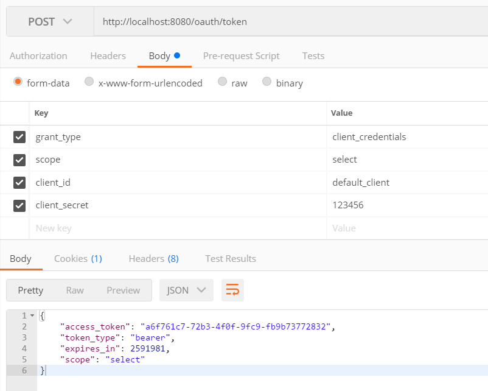
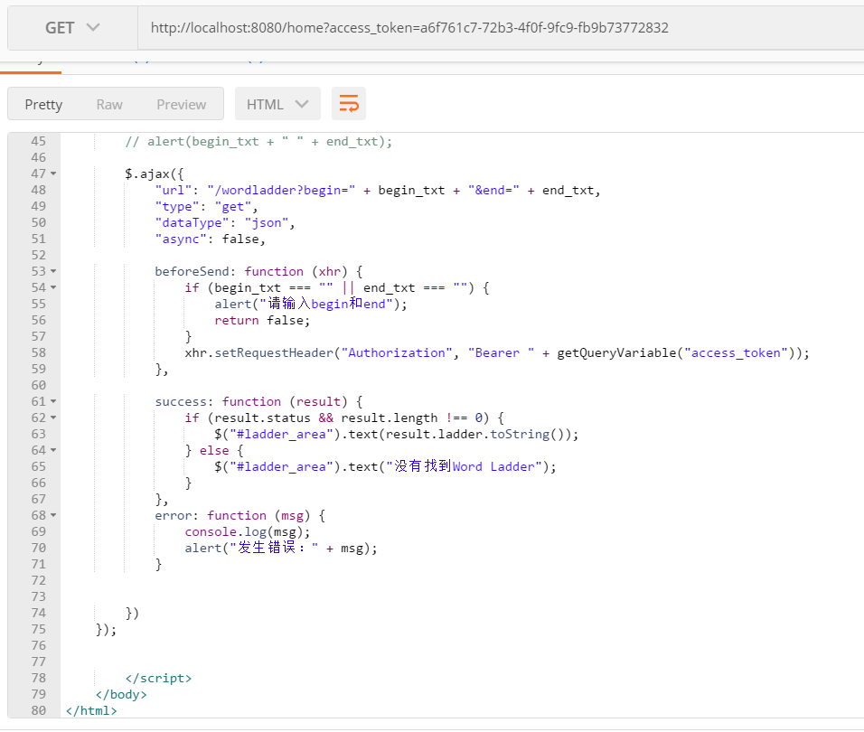
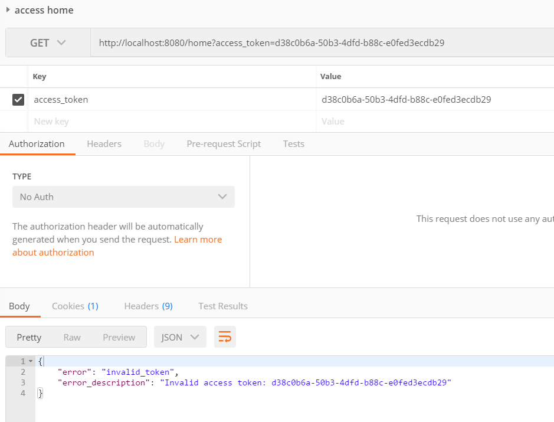
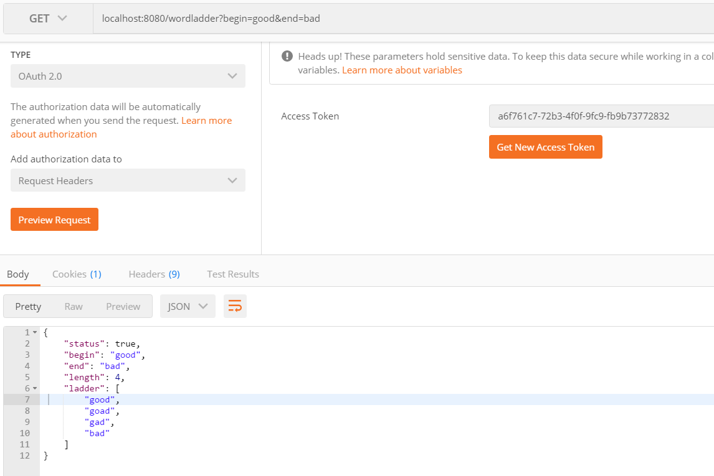
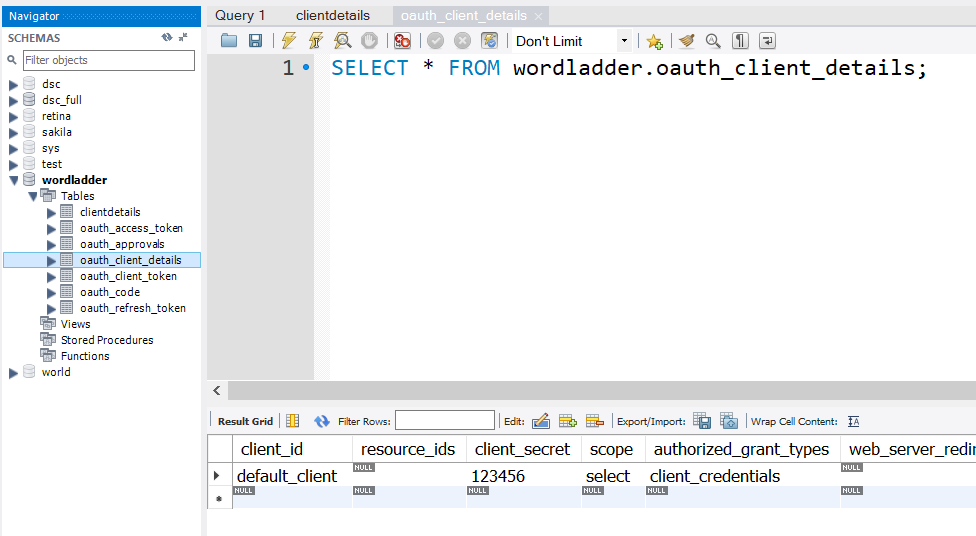
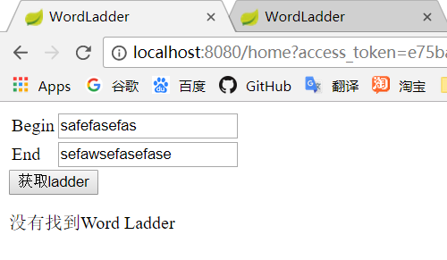
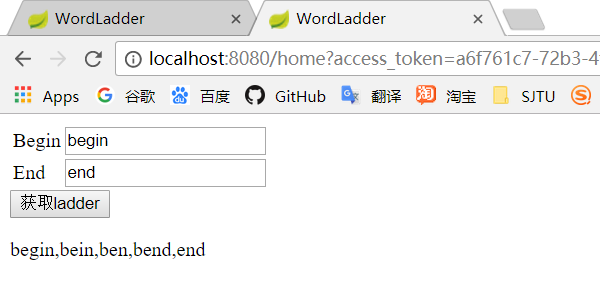

# Security WordLadder

## 1. 技术路线

- Spring boot
- Spring security
- Oauth2
- MySQL

## 2. 项目介绍

本项目是一个带有登录认证功能的wordladder程序，使用Gradle构建，搭建了一个简单的Oauth2认证服务器。

当用户没有被授权时，访问任何页面会被重定向到登录页面。在登录页面输入正确的用户名和密码，将可以跳转到主页面，在主页面可以使用wordladder的功能。

其内部的实现机理为：使用用户名和密码访问授权服务器，以此获取`token`，此后，用户便可以使用该token作为凭据访问本站页面。

## 3. 几点说明

1. 本项目最初使用了client和password两种认证模式，后来为了和数据库连接方便，将password方式删除，具体可见`OAuth2ServerConfig.java`中的部分被注释的代码

2. 本项目并没有自己配置MySQL，却完成了所有登录认证所需要的功能。这是因为框架已经为我们写好了JDBC实现，只需我们按照要求建立数据库([官方建表DDL](https://github.com/spring-projects/spring-security-oauth/blob/master/spring-security-oauth2/src/test/resources/schema.sql))，并实现`JdbcTokenStore`和`JdbcClientDetailsService`，即可自动完成连接。

3. 目前不支持注册功能，只能通过对数据库的直接操作增删用户

4. 前端采用`html5` + `js`(使用`jquery`)，没有定义任何`css`，因此登录页面及主界面非常简陋

## 4. 主要参考文章及`Github`项目

1. [Spring Security + Oauth2 部分： https://github.com/lexburner/oauth2-demo](https://github.com/lexburner/oauth2-demo)

2. [MySQL 部分：https://github.com/wanghongfei/spring-security-oauth2-example](https://github.com/wanghongfei/spring-security-oauth2-example)

## 5. 效果展示

  
获取token

----------------

  
成功凭借token进入主页面

----------------

  
凭借token获取wordladder

----------------

  
由于token不正确，认证不通过，无法进入主页面

----------------

  
MySQL截图

----------------

  
获取ladder(无结果)

----------------

  
成功获取ladder

